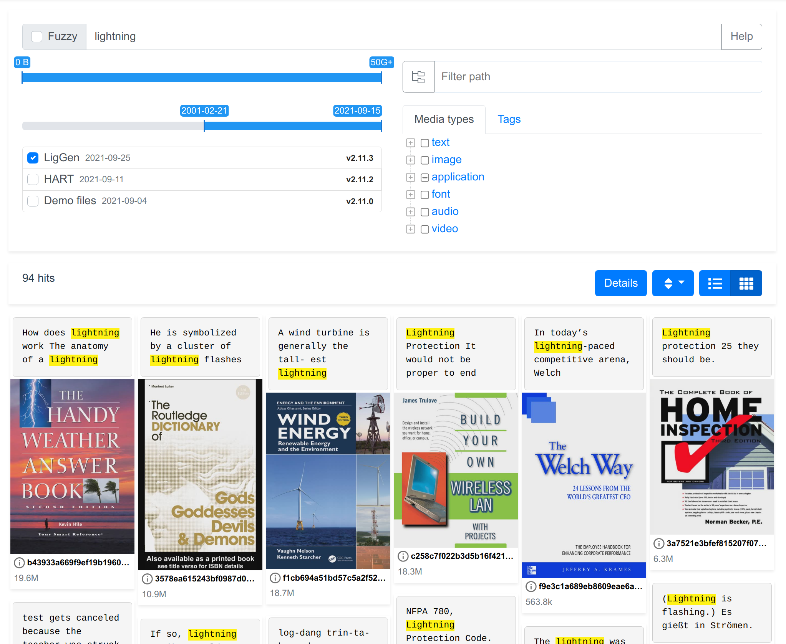
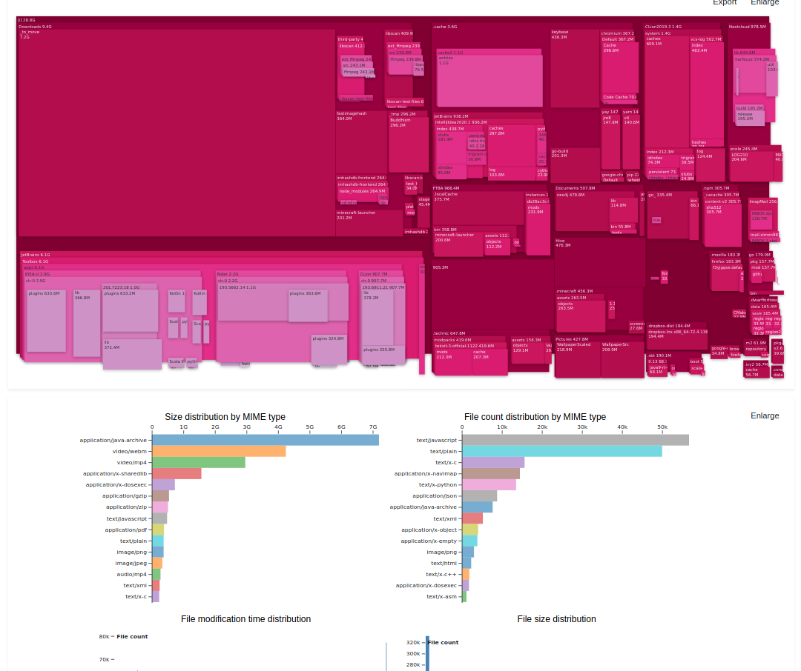

[](https://www.codefactor.io/repository/github/simon987/sist2)
[](https://files.simon987.net/.gate/sist2/simon987_sist2/)

**Demo**: [sist2.simon987.net](https://sist2.simon987.net/?i=Demo%20files)

# sist2

sist2 (Simple incremental search tool)

*Warning: sist2 is in early development*



## Features

* Fast, low memory usage, multi-threaded
* Mobile-friendly Web interface
* Portable (all its features are packaged in a single executable)
* Extracts text and metadata from common file types \*
* Generates thumbnails \*
* Incremental scanning
* Manual tagging from the UI and automatic tagging based on file attributes via [user scripts](docs/scripting.md)
* Recursive scan inside archive files \*\*
* OCR support with tesseract \*\*\*
* Stats page & disk utilisation visualization

\* See [format support](#format-support)    
\*\* See [Archive files](#archive-files)    
\*\*\* See [OCR](#ocr)



## Getting Started

1. Have an Elasticsearch (>= 6.8.X, ideally >=7.14.0) instance running
    1. Download [from official website](https://www.elastic.co/downloads/elasticsearch)
    1. *(or)* Run using docker:
        ```bash
        docker run -d --name es1 -p 9201:9200 -e "discovery.type=single-node" elasticsearch:7.14.0
        ```
    1. *(or)* Run using docker-compose:
        ```yaml
          elasticsearch:
            image: docker.elastic.co/elasticsearch/elasticsearch:7.14.0
            environment:
              - discovery.type=single-node
              - "ES_JAVA_OPTS=-Xms1G -Xmx2G"
        ```
1. Download sist2 executable
    1. Download the [latest sist2 release](https://github.com/simon987/sist2/releases) *
    1. *(or)* Download a [development snapshot](https://files.simon987.net/.gate/sist2/simon987_sist2/) *(Not
       recommended!)*
    1. *(or)* `docker pull simon987/sist2:2.11.4-x64-linux`

1. See [Usage guide](docs/USAGE.md)

\* *Windows users*: **sist2** runs under [WSL](https://en.wikipedia.org/wiki/Windows_Subsystem_for_Linux)

## Example usage

See [Usage guide](docs/USAGE.md) for more details

1. Scan a directory: `sist2 scan ~/Documents -o ./docs_idx`
1. Push index to Elasticsearch: `sist2 index ./docs_idx`
1. Start web interface: `sist2 web ./docs_idx`

## Format support

File type | Library | Content | Thumbnail | Metadata
:---|:---|:---|:---|:---
pdf,xps,fb2,epub | MuPDF | text+ocr | yes | author, title |
cbz,cbr | [libscan](https://github.com/simon987/libscan) | - | yes | - |
`audio/*` | ffmpeg | - | yes | ID3 tags |
`video/*` | ffmpeg | - | yes | title, comment, artist |
`image/*` | ffmpeg | - | yes | [Common EXIF tags](https://github.com/simon987/sist2/blob/efdde2734eca9b14a54f84568863b7ffd59bdba3/src/parsing/media.c#L190), GPS tags |
raw, rw2, dng, cr2, crw, dcr, k25, kdc, mrw, pef, xf3, arw, sr2, srf, erf  | LibRaw | - | yes | Common EXIF tags, GPS tags |
ttf,ttc,cff,woff,fnt,otf | Freetype2 | - | yes, `bmp` | Name & style |
`text/plain` | [libscan](https://github.com/simon987/libscan) | yes | no | - |
html, xml | [libscan](https://github.com/simon987/libscan) | yes | no | - |
tar, zip, rar, 7z, ar ...  | Libarchive | yes\* | - | no |
docx, xlsx, pptx | [libscan](https://github.com/simon987/libscan) | yes | if embedded | creator, modified_by, title |
doc (MS Word 97-2003) | antiword | yes | yes | author, title |
mobi, azw, azw3 | libmobi | yes | no | author, title |
wpd (WordPerfect) | libwpd | yes | no | *planned* |
json, jsonl, ndjson | [libscan](https://github.com/simon987/libscan) | yes | - | - |

\* *See [Archive files](#archive-files)*

### Archive files

**sist2** will scan files stored into archive files (zip, tar, 7z...) as if they were directly in the file system.
Recursive (archives inside archives)
scan is also supported.

**Limitations**:

* Support for parsing media files with formats that require *seek* (e.g. `.gif`, `.mp4` w/ fragmented metadata etc.)
  is limitted (see `--mem-buffer` option)
* Archive files are scanned sequentially, by a single thread. On systems where
  **sist2** is not I/O bound, scans might be faster when larger archives are split into smaller parts.

### OCR

You can enable OCR support for pdf,xps,fb2,epub file types with the
`--ocr <lang>` option. Download the language data files with your package manager (`apt install tesseract-ocr-eng`) or
directly [from Github](https://github.com/tesseract-ocr/tesseract/wiki/Data-Files).

The `simon987/sist2` image comes with common languages
(hin, jpn, eng, fra, rus, spa) pre-installed.

Examples

```bash
sist2 scan --ocr jpn ~/Books/Manga/
sist2 scan --ocr eng ~/Books/Textbooks/
```

## Build from source

You can compile **sist2** by yourself if you don't want to use the pre-compiled binaries

### With docker (recommended)

```bash
git clone --recursive https://github.com/simon987/sist2/
cd sist2
docker build . -f ./Dockerfile -t my-sist2-image
docker run --rm my-sist2-image cat /root/sist2 > sist2-x64-linux
```

### On a linux computer

1. Install compile-time dependencies

   ```bash
   apt install gcc g++ python3 yasm ragel automake autotools-dev wget libtool libssl-dev curl zip unzip tar xorg-dev libglu1-mesa-dev libxcursor-dev libxml2-dev libxinerama-dev gettext nasm git
   ```

1. Apply vcpkg patches, as per [sist2-build](https://github.com/simon987/sist2-build) Dockerfile

1. Install vcpkg dependencies

    ```bash
    vcpkg install curl[core,openssl]
    vcpkg install lmdb cjson glib brotli libarchive[core,bzip2,libxml2,lz4,lzma,lzo] pthread tesseract libxml2 libmupdf gtest mongoose libuuid libmagic libraw jasper lcms gumbo
    ```

1. Build
    ```bash
    git clone --recursive https://github.com/simon987/sist2/
    cmake -DSIST_DEBUG=off -DCMAKE_TOOLCHAIN_FILE=<VCPKG_ROOT>/scripts/buildsystems/vcpkg.cmake .
    make
    ```
