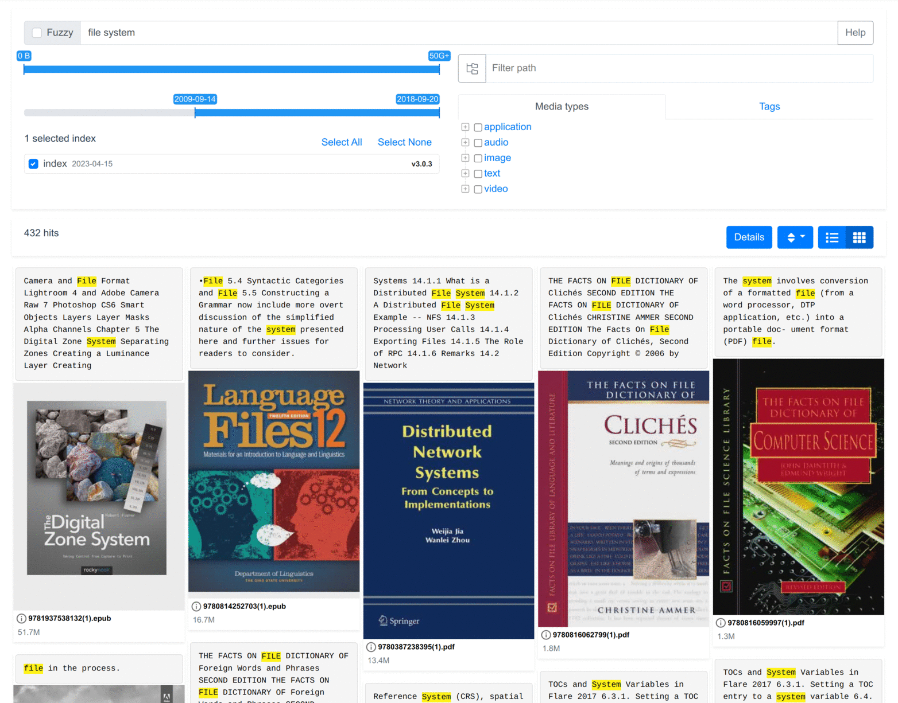
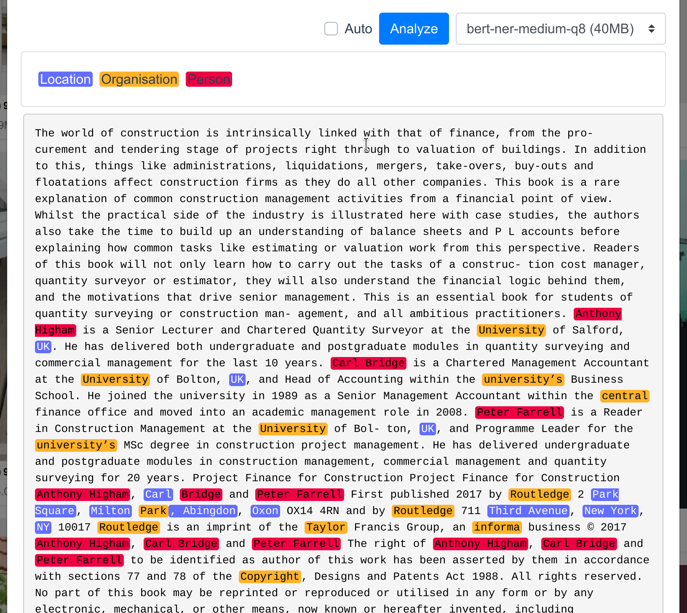

[](https://www.codefactor.io/repository/github/simon987/sist2)
[](https://files.simon987.net/.gate/sist2/simon987_sist2/)

**Demo**: [sist2.simon987.net](https://sist2.simon987.net/)

**Community URL:** [Discord](https://discord.gg/2PEjDy3Rfs)

# sist2

sist2 (Simple incremental search tool)

*Warning: sist2 is in early development*



## Features

* Fast, low memory usage, multi-threaded
* Manage & schedule scan jobs with simple web interface (Docker only)
* Mobile-friendly Web interface
* Extracts text and metadata from common file types \*
* Generates thumbnails \*
* Incremental scanning
* Manual tagging from the UI and automatic tagging based on file attributes via [user scripts](docs/scripting.md)
* Recursive scan inside archive files \*\*
* OCR support with tesseract \*\*\*
* Stats page & disk utilisation visualization
* Named-entity recognition (client-side) \*\*\*\*

\* See [format support](#format-support)    
\*\* See [Archive files](#archive-files)    
\*\*\* See [OCR](#ocr)    
\*\*\*\* See [Named-Entity Recognition](#NER)

## Getting Started

### Using Docker Compose *(Windows/Linux/Mac)*

```yaml
version: "3"

services:
  elasticsearch:
    image: elasticsearch:7.17.9
    restart: unless-stopped
    volumes:
      # This directory must have 1000:1000 permissions (or update PUID & PGID below)
      - /data/sist2-es-data/:/usr/share/elasticsearch/data
    environment:
      - "discovery.type=single-node"
      - "ES_JAVA_OPTS=-Xms2g -Xmx2g"
      - "PUID=1000"
      - "PGID=1000"
  sist2-admin:
    image: simon987/sist2:3.4.2-x64-linux
    restart: unless-stopped
    volumes:
      - /data/sist2-admin-data/:/sist2-admin/
      - /:/host
    ports:
      - 4090:4090
      # NOTE: Don't expose this port publicly!
      - 8080:8080
    working_dir: /root/sist2-admin/
    entrypoint: python3
    command:
      - /root/sist2-admin/sist2_admin/app.py
```

Navigate to http://localhost:8080/ to configure sist2-admin.

### Using the executable file *(Linux/WSL only)*

1. Choose search backend (See [comparison](#search-backends)):
    * **Elasticsearch**: have an Elasticsearch (version >= 6.8.X, ideally >=7.14.0) instance running
        1. Download [from official website](https://www.elastic.co/downloads/elasticsearch)
        2. *(or)* Run using docker:
            ```bash
            docker run -d -p 9200:9200 -e "discovery.type=single-node" elasticsearch:7.17.9
            ```
    * **SQLite**: No installation required

2. Download the [latest sist2 release](https://github.com/simon987/sist2/releases).
   Select the file corresponding to your CPU architecture and mark the binary as executable with `chmod +x`.
3. See [usage guide](docs/USAGE.md) for command line usage.

Example usage:

1. Scan a directory: `sist2 scan ~/Documents --output ./documents.sist2`
2. Prepare search index:
    * **Elasticsearch**: `sist2 index --es-url http://localhost:9200 ./documents.sist2`
    * **SQLite**: `sist2 sqlite-index --search-index ./search.sist2 ./documents.sist2`
3. Start web interface: 
   * **Elasticsearch**: `sist2 web ./documents.sist2`
   * **SQLite**: `sist2 web --search-index ./search.sist2 ./documents.sist2`

## Format support

| File type                                                                 | Library                                                                      | Content  | Thumbnail   | Metadata                                                                                                                               |
|:--------------------------------------------------------------------------|:-----------------------------------------------------------------------------|:---------|:------------|:---------------------------------------------------------------------------------------------------------------------------------------|
| pdf,xps,fb2,epub                                                          | MuPDF                                                                        | text+ocr | yes         | author, title                                                                                                                          |
| cbz,cbr                                                                   | [libscan](https://github.com/simon987/sist2/tree/master/third-party/libscan) | -        | yes         | -                                                                                                                                      |
| `audio/*`                                                                 | ffmpeg                                                                       | -        | yes         | ID3 tags                                                                                                                               |
| `video/*`                                                                 | ffmpeg                                                                       | -        | yes         | title, comment, artist                                                                                                                 |
| `image/*`                                                                 | ffmpeg                                                                       | ocr      | yes         | [Common EXIF tags](https://github.com/simon987/sist2/blob/efdde2734eca9b14a54f84568863b7ffd59bdba3/src/parsing/media.c#L190), GPS tags |
| raw, rw2, dng, cr2, crw, dcr, k25, kdc, mrw, pef, xf3, arw, sr2, srf, erf | LibRaw                                                                       | no       | yes         | Common EXIF tags, GPS tags                                                                                                             |
| ttf,ttc,cff,woff,fnt,otf                                                  | Freetype2                                                                    | -        | yes, `bmp`  | Name & style                                                                                                                           |
| `text/plain`                                                              | [libscan](https://github.com/simon987/sist2/tree/master/third-party/libscan) | yes      | no          | -                                                                                                                                      |
| html, xml                                                                 | [libscan](https://github.com/simon987/sist2/tree/master/third-party/libscan) | yes      | no          | -                                                                                                                                      |
| tar, zip, rar, 7z, ar ...                                                 | Libarchive                                                                   | yes\*    | -           | no                                                                                                                                     |
| docx, xlsx, pptx                                                          | [libscan](https://github.com/simon987/sist2/tree/master/third-party/libscan) | yes      | if embedded | creator, modified_by, title                                                                                                            |
| doc (MS Word 97-2003)                                                     | antiword                                                                     | yes      | no          | author, title                                                                                                                          |
| mobi, azw, azw3                                                           | libmobi                                                                      | yes      | yes         | author, title                                                                                                                          |
| wpd (WordPerfect)                                                         | libwpd                                                                       | yes      | no          | *planned*                                                                                                                              |
| json, jsonl, ndjson                                                       | [libscan](https://github.com/simon987/sist2/tree/master/third-party/libscan) | yes      | -           | -                                                                                                                                      |

\* *See [Archive files](#archive-files)*

### Archive files

**sist2** will scan files stored into archive files (zip, tar, 7z...) as if they were directly in the file system.
Recursive (archives inside archives)
scan is also supported.

**Limitations**:

* Support for parsing media files with formats that require *seek* (e.g. `.gif`, `.mp4` w/ fragmented metadata etc.)
  is limitted (see `--mem-buffer` option)
* Archive files are scanned sequentially, by a single thread. On systems where
  **sist2** is not I/O bound, scans might be faster when larger archives are split into smaller parts.

### OCR

You can enable OCR support for ebook (pdf,xps,fb2,epub) or image file types with the
`--ocr-lang <lang>` option in combination with `--ocr-images` and/or `--ocr-ebooks`.
Download the language data files with your package manager (`apt install tesseract-ocr-eng`) or
directly [from Github](https://github.com/tesseract-ocr/tesseract/wiki/Data-Files).

The `simon987/sist2` image comes with common languages
(hin, jpn, eng, fra, rus, spa, chi_sim, deu, pol) pre-installed.

You can use the `+` separator to specify multiple languages. The language
name must be identical to the `*.traineddata` file installed on your system
(use `chi_sim` rather than `chi-sim`).

Examples:

```bash
sist2 scan --ocr-ebooks --ocr-lang jpn ~/Books/Manga/
sist2 scan --ocr-images --ocr-lang eng ~/Images/Screenshots/
sist2 scan --ocr-ebooks --ocr-images --ocr-lang eng+chi_sim ~/Chinese-Bilingual/
```

### Search backends

sist2 v3.0.7+ supports SQLite search backend. The SQLite search backend has
fewer features and generally comparable query performance for medium-size
indices, but it uses much less memory and is easier to set up.

|                                              |                       SQLite                        |                                                             Elasticsearch                                                             |
|----------------------------------------------|:---------------------------------------------------:|:-------------------------------------------------------------------------------------------------------------------------------------:|
| Requires separate search engine installation |                                                     |                                                                   ✓                                                                   |
| Memory footprint                             |                        ~20MB                        |                                                                >500MB                                                                 |
| Query syntax                                 |      [fts5](https://www.sqlite.org/fts5.html)       | [query_string](https://www.elastic.co/guide/en/elasticsearch/reference/current/query-dsl-query-string-query.html#query-string-syntax) |
| Fuzzy search                                 |                                                     |                                                                   ✓                                                                   |
| Media Types tree real-time updating          |                                                     |                                                                   ✓                                                                   |
| Manual tagging                               |                          ✓                          |                                                                   ✓                                                                   |
| User scripts                                 |                          ✓                          |                                                                   ✓                                                                   |
| Media Type breakdown for search results      |                                                     |                                                                   ✓                                                                   |
| Embeddings search                            |                      ✓ *O(n)*                       |                                                              ✓ *O(logn)*                                                              |

### NER

sist2 v3.0.4+ supports named-entity recognition (NER). Simply add a supported repository URL to
**Configuration** > **Machine learning options** > **Model repositories**
to enable it.

The text processing is done in your browser, no data is sent to any third-party services.
See [simon987/sist2-ner-models](https://github.com/simon987/sist2-ner-models) for more details.

#### List of available repositories:

| URL                                                                                                     | Maintainer                              | Purpose |
|---------------------------------------------------------------------------------------------------------|-----------------------------------------|---------|
| [simon987/sist2-ner-models](https://raw.githubusercontent.com/simon987/sist2-ner-models/main/repo.json) | [simon987](https://github.com/simon987) | General |

<details>
  <summary>Screenshot</summary>



</details>

## Build from source

You can compile **sist2** by yourself if you don't want to use the pre-compiled binaries

### Using docker

```bash
git clone --recursive https://github.com/simon987/sist2/
cd sist2
docker build . -t my-sist2-image
# Copy sist2 executable from docker image
docker run --rm --entrypoint cat my-sist2-image /root/sist2 > sist2-x64-linux
```

### Using a linux computer

1. Install compile-time dependencies

   ```bash
   apt install gcc g++ python3 yasm ragel automake autotools-dev wget libtool libssl-dev curl zip unzip tar xorg-dev libglu1-mesa-dev libxcursor-dev libxml2-dev libxinerama-dev gettext nasm git nodejs
   ```

2. Install vcpkg using my fork: https://github.com/simon987/vcpkg
3. Install vcpkg dependencies

    ```bash
    vcpkg install openblas curl[core,openssl] sqlite3[core,fts5,json1] cpp-jwt pcre cjson brotli libarchive[core,bzip2,libxml2,lz4,lzma,lzo] pthread tesseract libxml2 libmupdf[ocr] gtest mongoose libmagic libraw gumbo ffmpeg[core,avcodec,avformat,swscale,swresample,webp,opus,mp3lame,vpx,zlib]
    ```

4. Build
    ```bash
    git clone --recursive https://github.com/simon987/sist2/
    (cd sist2-vue; npm install; npm run build)
    (cd sist2-admin/frontend; npm install; npm run build)
    cmake -DSIST_DEBUG=off -DCMAKE_TOOLCHAIN_FILE=<VCPKG_ROOT>/scripts/buildsystems/vcpkg.cmake .
    make
    ```
