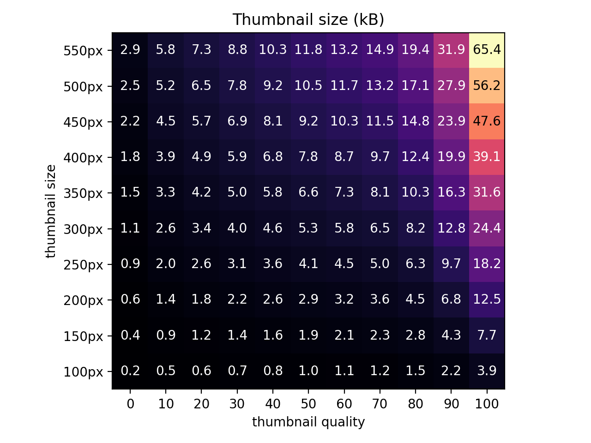

# Usage

```
Usage: sist2 scan [OPTION]... PATH
   or: sist2 index [OPTION]... INDEX
   or: sist2 web [OPTION]... INDEX...
   or: sist2 exec-script [OPTION]... INDEX

Lightning-fast file system indexer and search tool.

    -h, --help                        show this help message and exit
    -v, --version                     Print version and exit.
    --verbose                         Turn on logging.
    --very-verbose                    Turn on debug messages.
    --json-logs                       Output logs in JSON format.

Scan options
    -t, --threads=<int>               Number of threads. DEFAULT: 1
    -q, --thumbnail-quality=<int>     Thumbnail quality, on a scale of 2 to 31, 2 being the best. DEFAULT: 2
    --thumbnail-size=<int>            Thumbnail size, in pixels. DEFAULT: 552
    --thumbnail-count=<int>           Number of thumbnails to generate. Set a value > 1 to create video previews, set to 0 to disable thumbnails. DEFAULT: 1
    --content-size=<int>              Number of bytes to be extracted from text documents. Set to 0 to disable. DEFAULT: 32768
    -o, --output=<str>                Output index file path. DEFAULT: index.sist2
    --incremental                     If the output file path exists, only scan new or modified files.
    --optimize-index                  Defragment index file after scan to reduce its file size.
    --rewrite-url=<str>               Serve files from this url instead of from disk.
    --name=<str>                      Index display name. DEFAULT: index
    --depth=<int>                     Scan up to DEPTH subdirectories deep. Use 0 to only scan files in PATH. DEFAULT: -1
    --archive=<str>                   Archive file mode (skip|list|shallow|recurse). skip: don't scan, list: only save file names as text, shallow: don't scan archives inside archives. DEFAULT: recurse
    --archive-passphrase=<str>        Passphrase for encrypted archive files
    --ocr-lang=<str>                  Tesseract language (use 'tesseract --list-langs' to see which are installed on your machine)
    --ocr-images                      Enable OCR'ing of image files.
    --ocr-ebooks                      Enable OCR'ing of ebook files.
    -e, --exclude=<str>               Files that match this regex will not be scanned.
    --fast                            Only index file names & mime type.
    --treemap-threshold=<str>         Relative size threshold for treemap (see USAGE.md). DEFAULT: 0.0005
    --mem-buffer=<int>                Maximum memory buffer size per thread in MiB for files inside archives (see USAGE.md). DEFAULT: 2000
    --read-subtitles                  Read subtitles from media files.
    --fast-epub                       Faster but less accurate EPUB parsing (no thumbnails, metadata).
    --checksums                       Calculate file checksums when scanning.
    --list-file=<str>                 Specify a list of newline-delimited paths to be scanned instead of normal directory traversal. Use '-' to read from stdin.

Index options
    -t, --threads=<int>               Number of threads. DEFAULT: 1
    --es-url=<str>                    Elasticsearch url with port. DEFAULT: http://localhost:9200
    --es-insecure-ssl                 Do not verify SSL connections to Elasticsearch.
    --es-index=<str>                  Elasticsearch index name. DEFAULT: sist2
    -p, --print                       Print JSON documents to stdout instead of indexing to elasticsearch.
    --incremental-index               Conduct incremental indexing. Assumes that the old index is already ingested in Elasticsearch.
    --script-file=<str>               Path to user script.
    --mappings-file=<str>             Path to Elasticsearch mappings.
    --settings-file=<str>             Path to Elasticsearch settings.
    --async-script                    Execute user script asynchronously.
    --batch-size=<int>                Index batch size. DEFAULT: 70
    -f, --force-reset                 Reset Elasticsearch mappings and settings.

Web options
    --es-url=<str>                    Elasticsearch url. DEFAULT: http://localhost:9200
    --es-insecure-ssl                 Do not verify SSL connections to Elasticsearch.
    --es-index=<str>                  Elasticsearch index name. DEFAULT: sist2
    --bind=<str>                      Listen for connections on this address. DEFAULT: localhost:4090
    --auth=<str>                      Basic auth in user:password format
    --auth0-audience=<str>            API audience/identifier
    --auth0-domain=<str>              Application domain
    --auth0-client-id=<str>           Application client ID
    --auth0-public-key-file=<str>     Path to Auth0 public key file extracted from <domain>/pem
    --tag-auth=<str>                  Basic auth in user:password format for tagging
    --tagline=<str>                   Tagline in navbar
    --dev                             Serve html & js files from disk (for development)
    --lang=<str>                      Default UI language. Can be changed by the user

Exec-script options
    --es-url=<str>                    Elasticsearch url. DEFAULT: http://localhost:9200
    --es-insecure-ssl                 Do not verify SSL connections to Elasticsearch.
    --es-index=<str>                  Elasticsearch index name. DEFAULT: sist2
    --script-file=<str>               Path to user script.
    --async-script                    Execute user script asynchronously.

Made by simon987 <me@simon987.net>. Released under GPL-3.0
```

#### Thumbnail database size estimation

See chart below for rough estimate of thumbnail size vs. thumbnail size & quality arguments:

For example, `--thumbnail-size=500`, `--thumbnail-quality=2` for a directory with 8 million images will create a thumbnail database 
that is about `8000000 * 36kB = 288GB`.



### Scan examples

Simple scan
```bash
sist2 scan ~/Documents

sist2 scan \
    --threads 4 --content-size 16000000 --thumbnail-quality 2 --archive shallow \
    --name "My Documents" --rewrite-url "http://nas.domain.local/My Documents/" \
    ~/Documents -o ./documents.sist2
```

Incremental scan

If the index file does not exist, `--incremental` has no effect.
```bash
sist scan ~/Documents -o ./documents.sist2
sist scan ~/Documents -o ./documents.sist2 --incremental
# or
sist scan ~/Documents -o ./documents.sist2 --incremental
sist scan ~/Documents -o ./documents.sist2 --incremental
```

### Index examples

**Push to elasticsearch**
```bash
sist2 index --force-reset --batch-size 1000 --es-url http://localhost:9200 ./my_index/
sist2 index ./my_index/
```

**Save index in JSON format**
```bash
sist2 index --print ./my_index/ > my_index.ndjson
```

**Inspect contents of an index**
```bash
sist2 index --print ./my_index/ | jq | less
```

## Web

### Web options
 * `--es-url=<str>` Elasticsearch url.
 * `--es-index` 
    Elasticsearch index name. DEFAULT=sist2
 * `--bind=<str>` Listen on this address.
 * `--auth=<str>` Basic auth in user:password format
 * `--tag-auth=<str>` Basic auth in user:password format. Works the same way as the 
    `--auth` argument, but authentication is only applied the `/tag/` endpoint.
 * `--tagline=<str>` When specified, will replace the default tagline in the navbar.
 * `--dev` Serve html & js files from disk (for development, used to modify frontend files without having to recompile)
 * `--lang=<str>` Set the default web UI language (See #180 for a list of supported languages, default
   is `en`). The user can change the language in the configuration page
 * `--auth0-audience`, `--auth0-domain`, `--auth0-client-id`, `--auth0-public-key-file` See [Authentication with Auth0](auth0.md)

### Web examples

**Single index**
```bash
sist2 web --auth admin:hunter2 --bind 0.0.0.0:8888 my_index
```

**Multiple indices**
```bash
# Indices will be displayed in this order in the web interface
sist2 web index1 index2 index3 index4
```

### rewrite_url

When the `rewrite_url` field is not empty, the web module ignores the `root`
field and will return a HTTP redirect to `<rewrite_url><path>/<name><extension>`
instead of serving the file from disk. 
Both the `root` and `rewrite_url` fields are safe to manually modify from the 
`descriptor.json` file.

# Elasticsearch

Elasticsearch versions >=6.8.0, 7.X.X and 8.X.X are supported by sist2. 

Using a version >=7.14.0 is recommended to enable the following features:

- Bug fix for large documents (See #198)

When using a legacy version of ES, a notice will be displayed next to the sist2 version in the web UI.
If you don't care about the features above, you can ignore it or disable it in the configuration page.

## exec-script

The `exec-script` command is used to execute a user script for an index that has already been imported to Elasticsearch with the `index` command. Note that the documents will not be reset to their default state before each execution as the `index` command does: if you make undesired changes to the documents by accident, you will need to run `index` again to revert to the original state.


# Tagging

### Manual tagging

You can modify tags of individual documents directly from the 
 `web` interface. Note that you can setup authentication for this feature
 with the `--tag-auth` option (See [web options](#web-options))


Tags that are manually added are saved both in the 
 index folder (in `/tags/`) and in Elasticsearch*. When re-`index`ing, 
 they are read from the index and automatically applied.
 
You can safely copy the `/tags/` database to another index.

See [Automatic tagging](#automatic-tagging) for information about tag 
 hierarchies and tag colors.

\* *It can take a few seconds to take effect in new search queries.*


### Automatic tagging

See [scripting](scripting.md) documentation.

# Sidecar files

When scanning, sist2 will read metadata from `.s2meta` JSON files and overwrite the 
original document's indexed metadata (does not modify the actual file). Sidecar metadata files will also work inside archives.
Sidecar files themselves are not saved in the index.

This feature is useful to leverage third-party applications such as speech-to-text or
OCR to add additional metadata to a file.

**Example**

```
~/Documents/
├── Video.mp4
└── Video.mp4.s2meta
```

The sidecar file must have exactly the same file path and the `.s2meta` suffix.

`Video.mp4.s2meta`:
```json
{
  "content": "This sidecar file will overwrite some metadata fields of Video.mp4",
  "author": "Some author",
  "duration": 12345,
  "bitrate": 67890,
  "some_arbitrary_field": [1,2,3]
}
```

```
sist2 scan ~/Documents -o ./docs.sist2
sist2 index ./docs.sist2
```

*NOTE*: It is technically possible to overwrite the `tag` value using sidecar files, however,
it is not currently possible to restore both manual tags and sidecar tags without user scripts
while reindexing.
